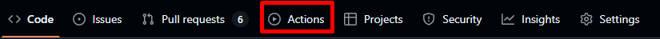
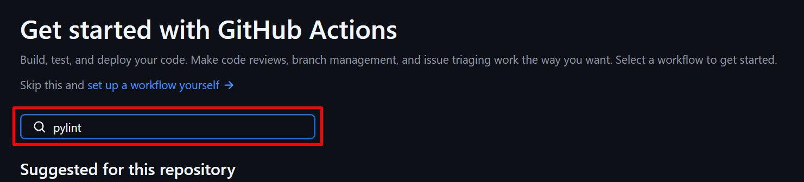
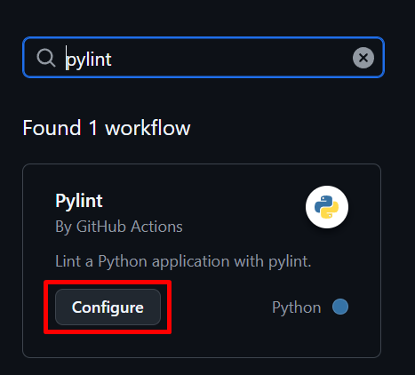
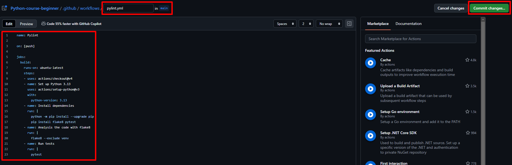
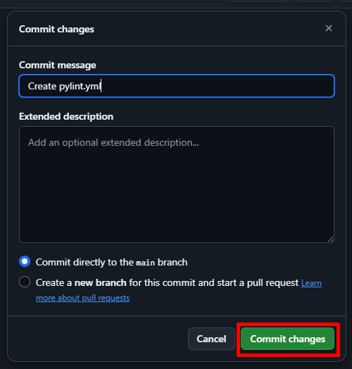
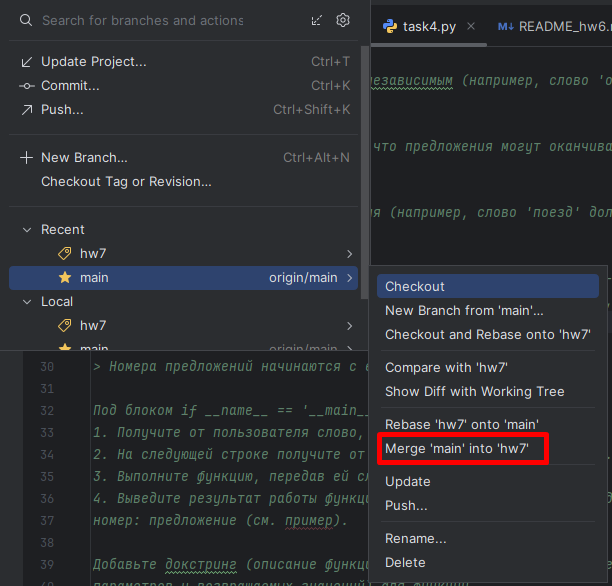
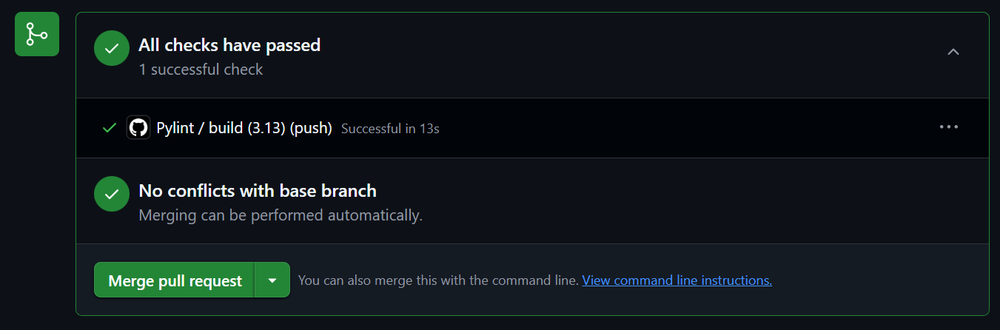

# Домашнее задание 6

Домашнее задание состоит из 6 частей:
1. Решить задачи.
2. Добавить докстринги (описание функций) и аннотации типов (указание типов
параметров и возвращаемых значений) для каждой функции. 
3. Запустить isort, black и flake8.
4. Запустить тесты к 6-му домашнему заданию и приложить скриншот результата тестирования.
5. Настроить pipeline.
6. Создать Pull Request на Github для проверки ДЗ.

## Часть 1
1. Откройте Pycharm и перейдите на ветку main. Обновите ее через Update Project.
2. Создайте новую ветку от main в PyCharm под названием "hw7".
3. Загрузите и распакуйте архив с 7 домашним заданием из iSpring.
Переместите папку в корень проекта. Создайте коммит с новыми файлами.
4. Решите задачи в PyCharm. После каждой решенной задачи делайте коммит.

## Часть 2
1. В каждой функции добавьте аннотации типов: как параметров, так и возвращаемых значений.
2. В каждой функции добавьте докстринг.

> Примеры аннотаций и докстрингов были приведены в файле README_hw6.md

Внимательно следите за следующими требованиями:
- Докстринг всегда начинается и заканчивается тремя двойными кавычками: `"""`.
- После имен параметров описание начинается с большой буквы.
- В конце всех предложений **всегда** ставится точка.
- Текст в докстринге не должен выходить за 79 символов.
Если текст выходит за данную границу, его нужно перенести на следующую строчку.

## Часть 3
1. Запустите isort через консоль: `isort .`
2. Запустите black через консоль: `black --line-length 79 .`
3. Запустите flake8 через консоль: `flake8`.
4. Исправьте замечания, которые выдал flake8. После исправления еще раз запустите пункты 1-3.
5. Сделайте commit с исправленными файлами.

## Часть 4
1. Запустите тесты через консоль с помощью команды `pytest hw7/`.
2. Если тесты не прошли - посмотрите какой тест не прошел. 
3. Исправьте задачу и запустите тесты заново, пока они не будут пройдены.
4. Приложите скриншот пройденных тестов в папку hw7. Назовите файл "hw7_tests".
5. Сделайте commit с исправленными файлами.

## Часть 5
1. Зайдите в свой репозиторий на github.
2. Перейдите во вкладку "Actions".



3. В поисковой строке наберите "pylint" и нажмите Enter.



4. Нажмите "Configure" в найденной карточке.



5. Удалите весь текст из файла.
6. Затем скопируйте текст ниже в файл на github
```yaml
name: Pylint

on: [push]

jobs:
  build:
    runs-on: ubuntu-latest
    steps:
    - uses: actions/checkout@v4
    - name: Set up Python 3.13
      uses: actions/setup-python@v3
      with:
        python-version: 3.13
    - name: Install dependencies
      run: |
        python -m pip install --upgrade pip
        pip install flake8 pytest
    - name: Analysis the code with flake8
      run: |
        flake8 --exclude venv
    - name: Run tests
      run: |
        pytest
```
7. Проверьте название файла "pylint.yml". Нажмите кнопку "Commit changes...".



8. Нажмите кнопку "Commit changes"



9. Перейдите на вкладку "Code" и проверьте, что папка ".github/workflows" появилась.


10. Перейдите на ветку main в Pycharm.
11. Обновите ветку main через Update Project.
12. Перейдите на ветку "hw7" влейте ветку main через "Merge 'main' into 'hw7'"



13. Проверьте, что в Pycharm в ветке hw7 появилась папка ".github/workflows".

## Часть 6
1. Откройте pull requests в github. Внимательно посмотрите из какой ветки (справа) в какую (слева) вы вносите изменения.
Слева должна быть ветка "main", то есть ветка вашего репозитория, справа - "hw7".
2. Проверьте, что pipeline прошел успешно. В случае успеха на github в PR будет написано "All checks have passed".
   - Если pipeline провален - просмотрите ошибку (нажмите на "Pylint / build...") и исправьте ее в Pycharm.
   - После исправления сделайте Commit and Push, чтобы исправление загрузилось в репозиторий.
> В предыдущих домашних заданиях могут возникнуть ошибки форматирования или тестирования - их тоже нужно поправить.



3. Поставьте в Reviewers преподавателей и ждите от них ревью. Приложите ссылку на PR при сдаче дз.

